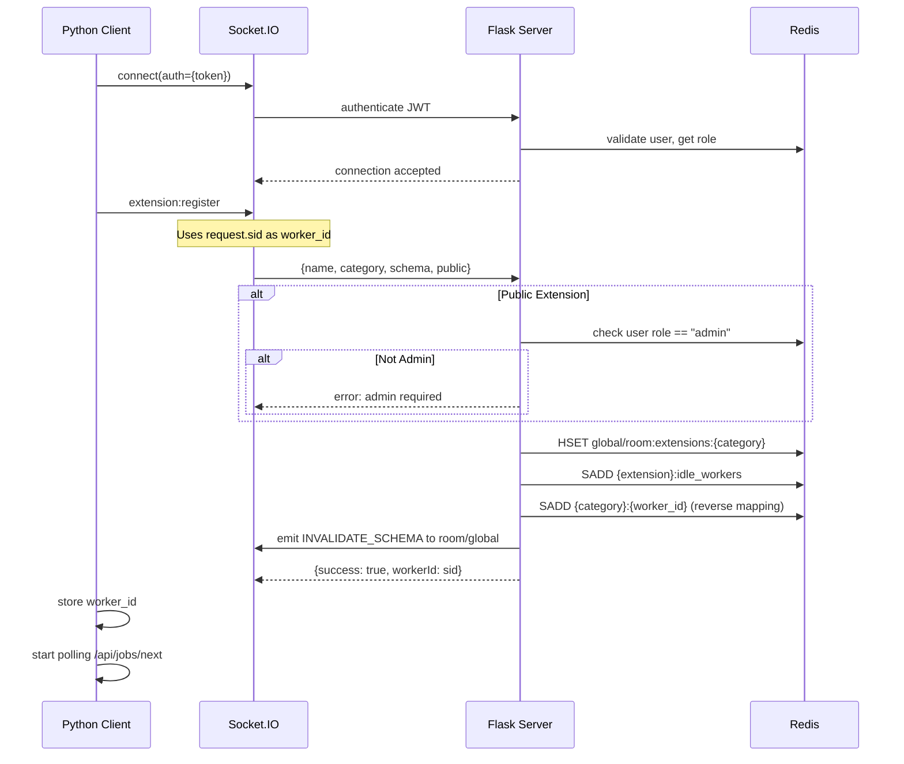
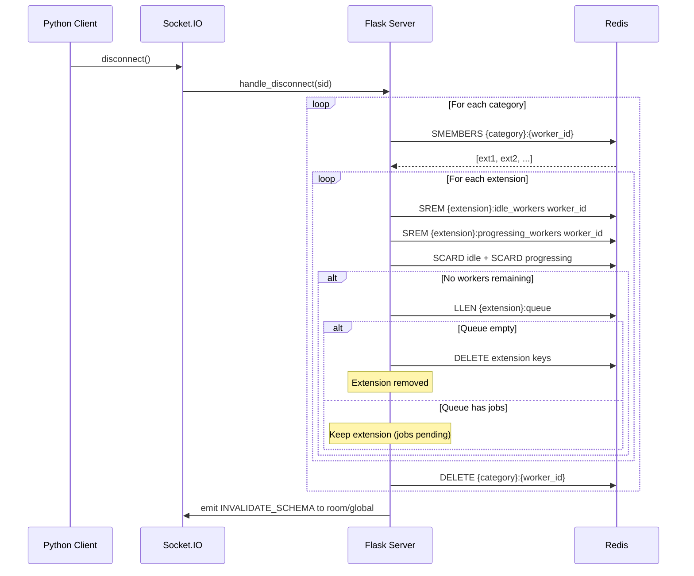
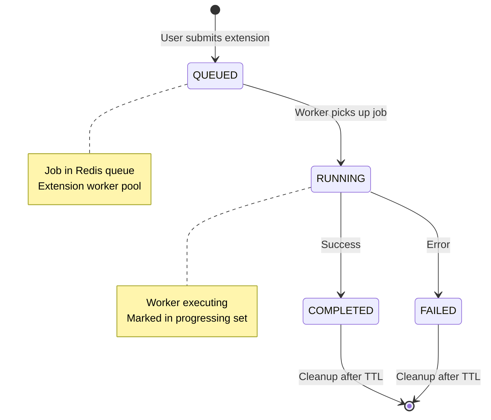
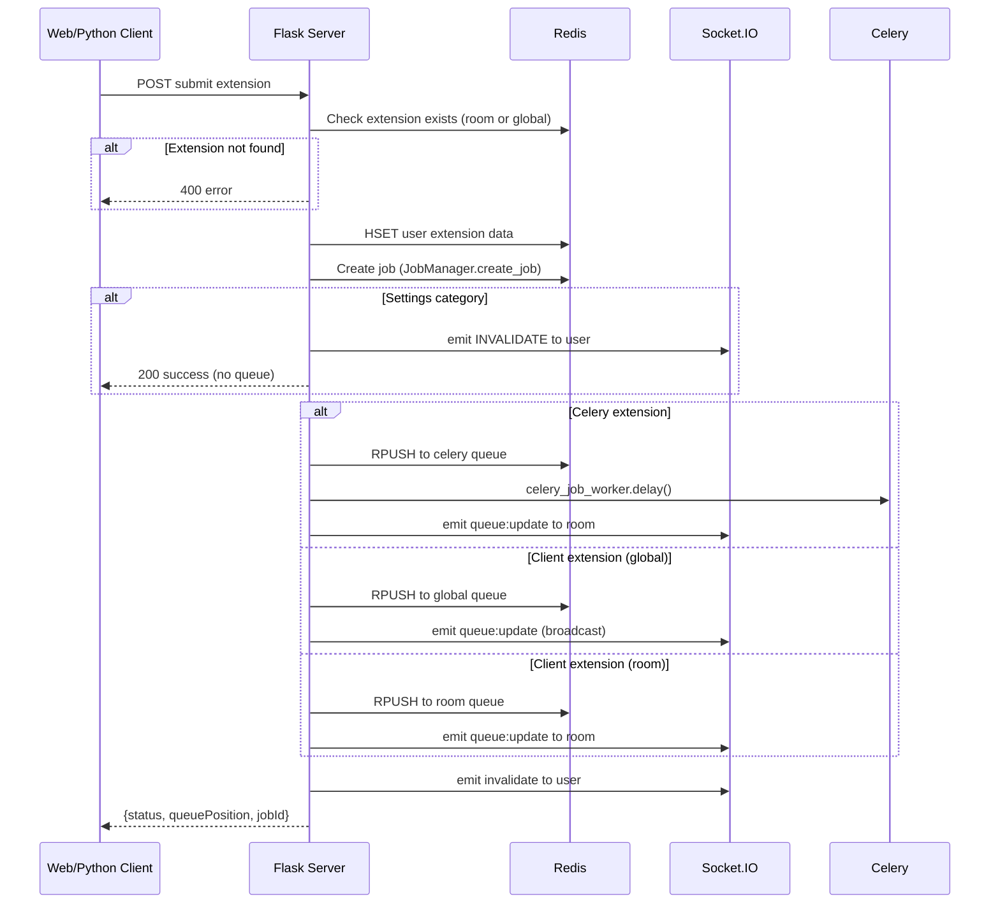
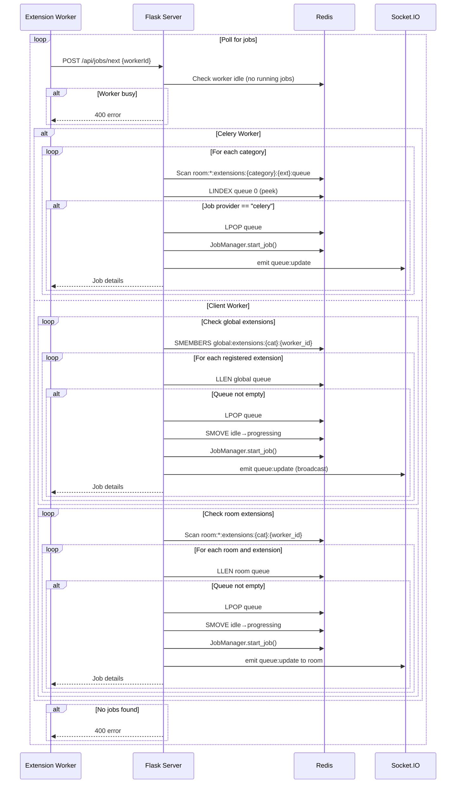
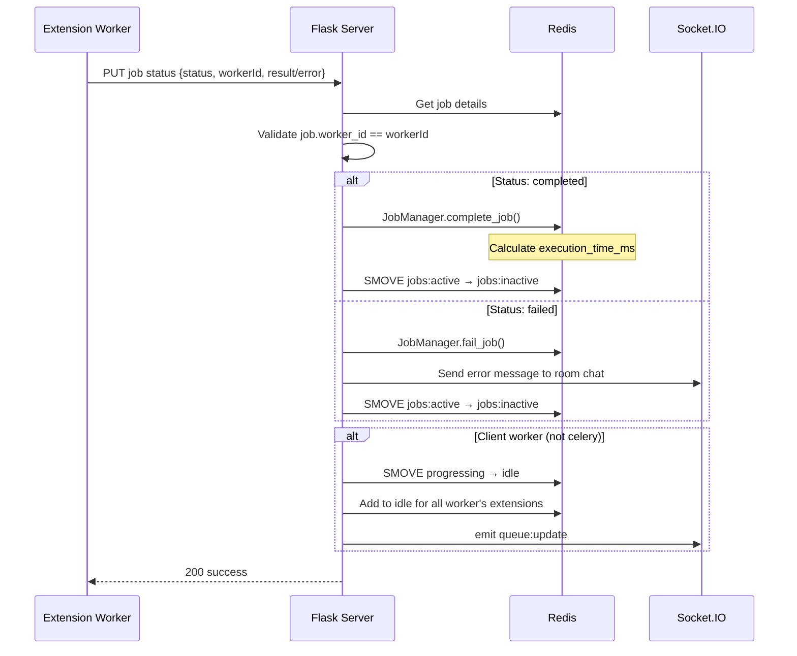
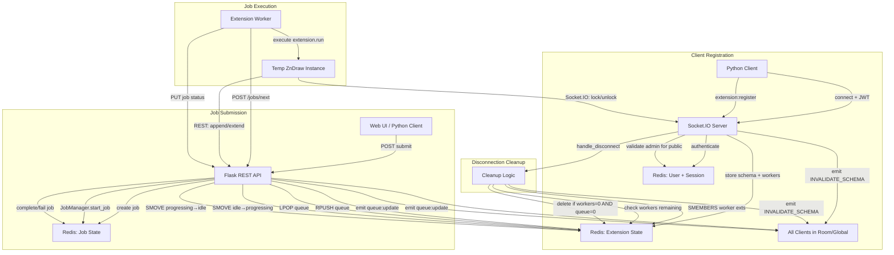
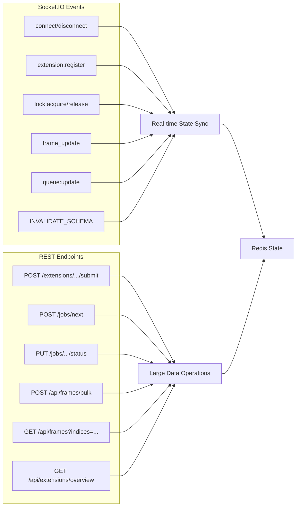
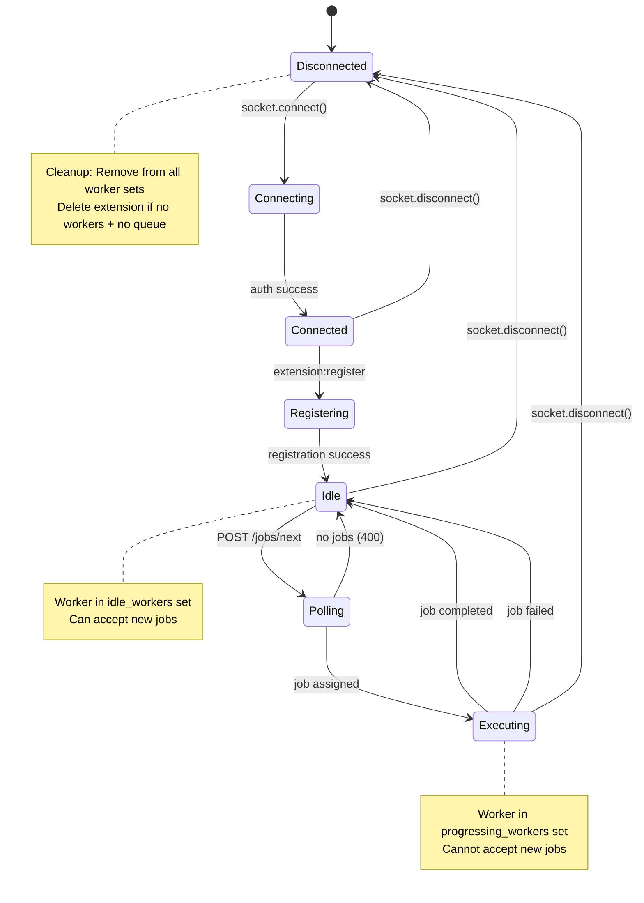

# ZnDraw Extension Architecture Documentation

**Version:** 1.0
**Date:** 2025-11-05
**Status:** Technical Reference

---

## Executive Summary

ZnDraw implements a distributed extension system that allows both server-side (Celery) and client-side (Python/Socket.IO) extensions to execute computational tasks across multiple rooms. The architecture uses Redis for state management, Socket.IO for real-time communication, and a hybrid REST/Socket.IO approach for data operations.

**Key Features:**
- Three extension execution models (Local/Celery, Remote per-room, Remote global)
- Job queue management with worker pooling
- Distributed lock mechanism for data consistency
- Automatic cleanup on disconnect
- Permission-based global extension registration

---

## Table of Contents

1. [Extension Types and Execution Models](#1-extension-types-and-execution-models)
2. [Registration and Lifecycle](#2-registration-and-lifecycle)
3. [Communication Architecture](#3-communication-architecture)
4. [Job Management and Queue System](#4-job-management-and-queue-system)
5. [State Management in Redis](#5-state-management-in-redis)
6. [Architecture Diagrams](#6-architecture-diagrams)
7. [Critical Analysis](#7-critical-analysis)

---

## 1. Extension Types and Execution Models

### 1.1 Server-Side (Celery) Extensions

**Location:** `/src/zndraw/extensions/` (modifiers.py, selections.py, analysis.py)

**Characteristics:**
- Always available (no registration needed)
- Executed by Celery workers
- Single worker pool processes all rooms
- Heavy computational tasks
- Background processing with task queues

**Example:**
```python
# src/zndraw/extensions/modifiers.py
class SupercellModifier(Extension):
    category = Category.MODIFIER
    a: int = 1
    b: int = 1
    c: int = 1

    def run(self, vis: "ZnDraw", **kwargs):
        atoms = vis.atoms
        # ... manipulation logic ...
        vis.atoms = new_atoms
```

**Provider:** `"celery"`

### 1.2 Remote Per-Room Extensions

**Location:** Client-side Python scripts

**Characteristics:**
- Registered via Socket.IO per room
- Worker maintains connection to specific room
- Room-scoped: only visible in that room
- Multiple workers can register same extension
- Cleanup on disconnect

**Example:**
```python
from zndraw import ZnDraw
from zndraw.extensions import Extension, Category

class CustomModifier(Extension):
    category = Category.MODIFIER
    param: float = 1.0

    def run(self, vis, **kwargs):
        # Custom logic here
        pass

vis = ZnDraw(room="my-room", auto_pickup_jobs=True)
vis.register_extension(CustomModifier, public=False)
```

**Provider:** `"client"`
**Redis Key Pattern:** `room:{room_id}:extensions:{category}:{extension}`

### 1.3 Remote Global Extensions

**Location:** Client-side Python scripts (admin only)

**Characteristics:**
- Registered via Socket.IO globally
- Requires admin privileges
- Visible across all rooms
- Single worker pool serves all rooms
- Job execution creates temporary room context

**Example:**
```python
vis = ZnDraw(room="admin-room", user="admin", password="admin_pass")
vis.register_extension(GlobalAnalyzer, public=True)  # Requires admin
```

**Provider:** `"client"`
**Redis Key Pattern:** `global:extensions:{category}:{extension}`

---

## 2. Registration and Lifecycle

### 2.1 Extension Registration Flow



**Key Points:**
1. **Worker ID Consistency:** Server's `request.sid` is used throughout lifecycle
2. **Admin Check:** Global extensions require `role == "admin"` from JWT
3. **Reverse Mapping:** `{category}:{worker_id}` → set of extension names
4. **Schema Broadcast:** All clients notified of new extension availability

### 2.2 Extension Unregistration (Disconnect)



**Cleanup Strategy:**
- Extension deleted only if: `workers == 0 AND queue_length == 0`
- Jobs in queue preserve extension metadata
- Reverse mapping ensures complete cleanup

### 2.3 Reconnection Handling

Located in `/src/zndraw/socket_manager.py:251-280`

```python
def _on_connect(self):
    # Re-register any extensions that were registered before connection
    for name, ext in self.zndraw._extensions.items():
        worker_id = self.zndraw.api.register_extension(
            name=name,
            category=ext["extension"].category,
            schema=ext["extension"].model_json_schema(),
            socket_manager=self,
            public=ext["public"],
        )
        if worker_id:
            self.zndraw._worker_id = worker_id
```

**Key Behavior:** Extensions persist in client memory and re-register on reconnect.

---

## 3. Communication Architecture

### 3.1 Hybrid REST/Socket.IO Design

**Socket.IO Used For:**
- Real-time updates (frame changes, selections, queue status)
- Extension registration/unregistration
- Distributed lock acquisition/release/refresh
- Chat messages
- Lightweight notifications

**REST Used For:**
- Large data operations (vis.append, vis.extend, vis.get)
- File uploads/downloads
- Extension job submission
- Job status updates
- Analytics queries

### 3.2 Why Large Operations Use REST

**Critical Design Decision:** Data operations like `vis.append()` and `vis.extend()` MUST use REST, not Socket.IO.

**Rationale:**
1. **Message Size Limits:** Socket.IO has practical message size limits (~1MB depending on server config)
2. **Buffering Issues:** Large messages can cause socket buffer overflow
3. **Timeout Handling:** HTTP has better timeout/retry semantics
4. **Progress Tracking:** HTTP supports streaming and chunked responses
5. **Load Balancing:** REST endpoints easier to load balance than socket connections

**Implementation:** `/src/zndraw/zndraw.py:637-651`

```python
def _perform_locked_upload(self, action: str, data, **kwargs):
    if not self.socket.sio.connected:
        raise RuntimeError("Client is not connected.")
    with self.lock:  # Socket.IO distributed lock
        return self.api.upload_frames(action, data, **kwargs)  # REST call
```

**Pattern:** Socket.IO lock + REST data operation = consistency + scalability

### 3.3 Distributed Lock Mechanism

**Purpose:** Prevent race conditions during trajectory modifications

**Implementation:** `/src/zndraw/socket_manager.py:18-206`

**Features:**
- Re-entrant locks (same client can acquire multiple times)
- Automatic TTL refresh (background thread)
- Lock metadata (progress messages)
- Lock timeout (max 300 seconds)

```python
with vis.lock(msg="Uploading 1000 frames..."):
    vis.extend(large_trajectory)
```

**Lock Events:**
- `lock:acquire` - Request lock with TTL
- `lock:release` - Release lock
- `lock:refresh` - Extend TTL (auto-called by background thread)
- `lock:msg` - Update lock metadata

**Redis Keys:**
```
room:{room_id}:lock:trajectory:meta = userName (with TTL)
room:{room_id}:lock:trajectory:meta:metadata = JSON metadata
```

---

## 4. Job Management and Queue System

### 4.1 Job Lifecycle



**Job States:**
- `QUEUED`: In extension queue, waiting for worker
- `RUNNING`: Assigned to worker, executing
- `COMPLETED`: Successfully finished
- `FAILED`: Error during execution

**Timing Metrics:**
- `wait_time_ms`: `started_at - created_at`
- `execution_time_ms`: `completed_at - started_at`

### 4.2 Job Submission Flow

**REST Endpoint:** `POST /api/rooms/{room_id}/extensions/{category}/{extension}/submit`



**Key File:** `/src/zndraw/app/extension_routes.py:23-201`

### 4.3 Worker Job Polling

**REST Endpoint:** `POST /api/jobs/next`



**Key File:** `/src/zndraw/app/job_routes.py:228-481`

**Polling Behavior:**
- Workers poll continuously (exponential backoff recommended)
- Priority: global extensions → room extensions (for client workers)
- Worker state: `idle` → `progressing` when job assigned

### 4.4 Job Completion Flow

**REST Endpoint:** `PUT /api/rooms/{room_id}/jobs/{job_id}/status`



**Key File:** `/src/zndraw/app/job_routes.py:136-225`

**Transition Logic:**
```python
def _transition_worker_to_idle(redis, socketio, worker_id, job, room_id, success):
    # Move worker from progressing to idle for completed extension
    keys = ExtensionKeys.for_extension(room_id, category, extension)
    redis.smove(keys.progressing_workers, keys.idle_workers, worker_id)

    # Get all extensions this worker registered for
    user_extensions = redis.smembers(f"{category}:{worker_id}")

    # Add worker to idle set for ALL registered extensions
    for ext_name in user_extensions:
        ext_keys = ExtensionKeys.for_extension(room_id, category, ext_name)
        redis.srem(ext_keys.progressing_workers, worker_id)
        redis.sadd(ext_keys.idle_workers, worker_id)
```

**Critical:** Worker can handle multiple extensions, so it's added to idle set for all.

---

## 5. State Management in Redis

### 5.1 Redis Key Patterns

**Extension State (Room-Scoped):**
```redis
# Schema storage (hash)
room:{room_id}:extensions:{category} = hash {extension_name → JSON schema}

# Worker pools (sets)
room:{room_id}:extensions:{category}:{extension}:idle_workers = set [worker_id1, ...]
room:{room_id}:extensions:{category}:{extension}:progressing_workers = set [worker_id2, ...]

# Job queue (list)
room:{room_id}:extensions:{category}:{extension}:queue = list [job_json1, job_json2, ...]

# Reverse mapping (set)
room:{room_id}:extensions:{category}:{worker_id} = set [ext_name1, ext_name2, ...]
```

**Extension State (Global):**
```redis
# Schema storage
global:extensions:{category} = hash {extension_name → JSON schema}

# Worker pools
global:extensions:{category}:{extension}:idle_workers = set
global:extensions:{category}:{extension}:progressing_workers = set

# Job queue
global:extensions:{category}:{extension}:queue = list

# Reverse mapping
global:extensions:{category}:{worker_id} = set
```

**Job Tracking:**
```redis
# Job data (hash with TTL, default 24h)
job:{job_id} = hash {
    id, room, category, extension, data,
    user_name, status, provider,
    created_at, started_at, completed_at,
    worker_id, error, result,
    wait_time_ms, execution_time_ms
}

# Job indexes
room:{room_id}:jobs:active = set [job_id1, ...]  # queued or running
room:{room_id}:jobs:inactive = set [job_id2, ...]  # completed or failed
room:{room_id}:jobs:by_time = sorted_set {job_id → timestamp}
room:{room_id}:extension:{category}:{extension}:jobs = set [job_id1, ...]
```

**Session State:**
```redis
# Session mapping
sid:{sid} = userName (string)
sid:{sid}:role = role (string: "admin" or "guest")

# User state
user:{userName} = hash {currentRoom, currentSid, lastActivity, ...}
```

**Locks:**
```redis
# Distributed lock (with TTL)
room:{room_id}:lock:{target} = userName (TTL: 60-300s)
room:{room_id}:lock:{target}:metadata = JSON {msg, userName, timestamp}
```

### 5.2 Dataflow Example: Extension Execution

**Scenario:** User submits a room-scoped extension job

```
1. Job Creation
   ┌─────────────────────────────────────────────────────────────┐
   │ POST /api/rooms/demo/extensions/modifiers/CustomMod/submit │
   └─────────────────────────────────────────────────────────────┘
                              │
                              ▼
          ┌────────────────────────────────────────┐
          │ JobManager.create_job()                │
          │ - Generate UUID                        │
          │ - Create job:{job_id} hash             │
          │ - Add to room:demo:jobs:active         │
          │ - Add to room:demo:extension:...:jobs  │
          └────────────────────────────────────────┘
                              │
                              ▼
          ┌────────────────────────────────────────┐
          │ RPUSH to extension queue               │
          │ room:demo:extensions:modifiers:        │
          │   CustomMod:queue                      │
          └────────────────────────────────────────┘
                              │
                              ▼
          ┌────────────────────────────────────────┐
          │ emit queue:update via Socket.IO        │
          │ to room:demo                           │
          └────────────────────────────────────────┘

2. Worker Polling
   ┌─────────────────────────────────────┐
   │ Worker: POST /api/jobs/next         │
   │ {workerId: "abc123"}                │
   └─────────────────────────────────────┘
                              │
                              ▼
          ┌────────────────────────────────────────┐
          │ Check: room:*:extensions:modifiers:    │
          │        abc123 (reverse mapping)        │
          │ Returns: ["CustomMod"]                 │
          └────────────────────────────────────────┘
                              │
                              ▼
          ┌────────────────────────────────────────┐
          │ LPOP from CustomMod:queue              │
          │ SMOVE abc123: idle → progressing       │
          │ JobManager.start_job()                 │
          └────────────────────────────────────────┘
                              │
                              ▼
          ┌────────────────────────────────────────┐
          │ Return job details to worker           │
          │ {jobId, room, category, extension,     │
          │  data, status: "running"}              │
          └────────────────────────────────────────┘

3. Job Execution
   ┌─────────────────────────────────────┐
   │ Worker creates temp ZnDraw instance │
   │ vis = ZnDraw.for_job_execution(     │
   │     room="demo", ...)               │
   └─────────────────────────────────────┘
                              │
                              ▼
          ┌────────────────────────────────────────┐
          │ Execute extension.run(vis, **data)     │
          │ - May call vis.append/extend (REST)    │
          │ - May modify geometries                │
          │ - May update selections                │
          └────────────────────────────────────────┘
                              │
                              ▼
          ┌────────────────────────────────────────┐
          │ PUT /api/rooms/demo/jobs/{id}/status   │
          │ {status: "completed",                  │
          │  workerId: "abc123"}                   │
          └────────────────────────────────────────┘
                              │
                              ▼
          ┌────────────────────────────────────────┐
          │ JobManager.complete_job()              │
          │ - Update job hash with completed_at    │
          │ - Calculate execution_time_ms          │
          │ - SMOVE jobs:active → jobs:inactive    │
          └────────────────────────────────────────┘
                              │
                              ▼
          ┌────────────────────────────────────────┐
          │ _transition_worker_to_idle()           │
          │ - SMOVE progressing → idle             │
          │ - Add to idle for all worker exts      │
          │ - emit queue:update                    │
          └────────────────────────────────────────┘
```

---

## 6. Architecture Diagrams

### 6.1 Complete Extension Lifecycle



### 6.2 Communication Flow: REST vs Socket.IO



### 6.3 Worker State Machine



### 6.4 Global vs Room-Scoped Extension Routing

```mermaid
graph TD
    A[User Submits Extension Job] --> B{Extension Type?}

    B -->|Server-Side| C[Check server-side modules]
    C --> D[Queue: room:*:extensions:{cat}:{ext}:queue]
    D --> E[Celery Worker Pool]
    E --> F[Execute in Any Room]

    B -->|Client Room-Scoped| G[Check room schema]
    G --> H[Queue: room:{room}:extensions:{cat}:{ext}:queue]
    H --> I[Client Workers in Room]
    I --> J[Execute in Room Context]

    B -->|Client Global| K[Check global schema]
    K --> L[Queue: global:extensions:{cat}:{ext}:queue]
    L --> M[Global Client Worker Pool]
    M --> N[Create Temp ZnDraw for Target Room]
    N --> O[Execute in Target Room Context]
```

---

## 7. Critical Analysis

### 7.1 Architecture Strengths

1. **Scalability via Worker Pooling**
   - Multiple workers can register for same extension
   - Horizontal scaling through additional worker processes
   - Load balancing via queue system

2. **Consistency through Distributed Locks**
   - Prevents race conditions during trajectory modifications
   - Re-entrant lock design allows complex operations
   - Automatic TTL refresh prevents deadlocks

3. **Clean Separation of Concerns**
   - Socket.IO: Real-time state synchronization
   - REST: Heavy data operations
   - Redis: Centralized state management

4. **Automatic Cleanup**
   - Extensions cleaned up on disconnect
   - Jobs have TTL (24h default)
   - Orphan detection (no workers + no queue)

5. **Permission Model**
   - Global extensions require admin role
   - JWT-based authentication
   - Per-room vs global scope

### 7.2 Potential Issues and Bottlenecks

#### Issue 1: Job Queue Starvation

**Problem:** If a worker registers for multiple extensions but only one has jobs, other extensions may starve.

**Current Mitigation:** Worker polling checks all registered extensions.

**Recommendation:** Implement priority queue or fair scheduling algorithm.

```python
# Potential improvement in job_routes.py
def fair_scheduler(redis, worker_id, registered_extensions):
    """Round-robin scheduling across worker's registered extensions."""
    last_executed = redis.get(f"worker:{worker_id}:last_extension")
    # Start from next extension after last executed
    # ...
```

#### Issue 2: Redis Key Explosion

**Problem:** Each extension × room × worker creates multiple Redis keys:
- Schema key
- Idle workers set
- Progressing workers set
- Queue list
- Reverse mapping set
- Per-extension jobs set

**Scale Estimate:**
- 10 rooms × 5 extensions × 3 workers = 150 worker registrations
- ~750+ Redis keys (not counting jobs)

**Current Mitigation:** Keys cleaned up on disconnect, TTL on job data.

**Recommendation:** Consider key expiration for idle extensions, periodic cleanup job.

#### Issue 3: Socket.IO Connection Limits

**Problem:** Each worker maintains persistent Socket.IO connection. At scale:
- 100 workers = 100 concurrent connections
- Connection overhead (memory, CPU)
- Socket.IO server limits

**Current Mitigation:** Workers share connections when possible (same process can reuse).

**Recommendation:**
- Consider WebSocket connection pooling
- Worker heartbeat mechanism to detect dead connections faster
- Connection limit monitoring and alerts

#### Issue 4: Lock Refresh Race Condition

**Problem:** Lock refresh happens in background thread every TTL/2. If lock holder crashes after refresh but before releasing, lock stays acquired for up to TTL seconds.

**Current Mitigation:** TTL max = 300 seconds, automatic expiration.

**Edge Case:**
```python
# Worker acquires lock with TTL=60s
with vis.lock():
    vis.extend(large_data)  # Takes 50s
    # Background thread refreshes at 30s
    # Worker crashes at 55s
    # Lock stays acquired until 85s (30s refresh + 60s TTL)
```

**Recommendation:** Add lock ownership validation in REST endpoints.

#### Issue 5: Global Extension Job Routing Complexity

**Problem:** Global extensions execute jobs from any room, requiring temporary ZnDraw instance creation per job.

**Performance Impact:**
- New HTTP connection per job
- New Socket.IO connection per job (for temp instance)
- Connection setup latency

**Current Code:** `/src/zndraw/socket_manager.py:349-385`

```python
def _on_task_run(self, data, extension, category, room):
    temp_vis = ZnDraw.for_job_execution(
        url=self.zndraw.url,
        room=room,  # Target room from job
        user=self.zndraw.user,
        password=getattr(self.zndraw, "password", None),
    )
    try:
        ext = self.zndraw._extensions[extension]["extension"]
        instance = ext(**(data))
        instance.run(temp_vis, ...)
    finally:
        if hasattr(temp_vis, "socket"):
            temp_vis.socket.disconnect()
```

**Recommendation:** Connection pooling for global workers, reuse connections across jobs in same room.

#### Issue 6: No Job Priority System

**Problem:** All jobs FIFO regardless of importance. Long-running jobs block queue for that extension.

**Example:**
```
Queue: [job1: 5min, job2: 1s, job3: 1s]
job2 and job3 wait 5 minutes even though they're fast
```

**Recommendation:** Add priority field to jobs, implement priority queue.

```python
# Proposed schema
job = {
    "priority": 0-10,  # 0=low, 10=urgent
    ...
}
redis.zadd(extension_priority_queue, {job_id: priority})
```

#### Issue 7: Celery Worker Discovery

**Problem:** Celery workers identified by `worker_id.startswith("celery")` string check (line 262 in job_routes.py). Brittle pattern matching.

**Current Code:**
```python
is_celery_worker = worker_id.startswith("celery")
```

**Recommendation:** Use explicit worker type field in registration:
```python
# Extension registration
{
    "name": "MyExtension",
    "workerType": "celery" | "client",
    ...
}
```

### 7.3 Scalability Considerations

#### Horizontal Scaling

**Current Support:**
- ✅ Multiple workers per extension
- ✅ Multiple extensions per worker
- ✅ Global worker pool serves all rooms
- ⚠️ Redis single-point-of-failure

**Recommendations:**
1. **Redis Cluster:** Shard keys by room_id for better distribution
2. **Read Replicas:** Offload analytics queries to replicas
3. **Job Queue Partitioning:** Separate queues for fast/slow extensions

#### Vertical Scaling Limits

**Memory Bottlenecks:**
- Socket.IO connections: ~1KB per connection (100 workers = 100KB)
- Redis keys: ~100 bytes per key (1000 keys = 100KB)
- Job data: Varies by job size (with TTL cleanup)

**CPU Bottlenecks:**
- Socket.IO event handling (single-threaded Node.js)
- Redis command processing (single-threaded)
- Lock refresh threads (one per locked operation)

**Network Bottlenecks:**
- Socket.IO message overhead
- REST API payload size for large trajectories
- Redis network latency

### 7.4 Error Handling Patterns

#### Positive Patterns

1. **Job Failure Tracking:** Failed jobs stored with error message
2. **Worker State Recovery:** Worker transitions to idle even on failure
3. **Queue Update Events:** UI notified of queue changes

#### Missing Patterns

1. **Retry Logic:** No automatic retry for transient failures
2. **Circuit Breaker:** No protection against repeatedly failing extensions
3. **Dead Letter Queue:** Failed jobs not preserved beyond TTL
4. **Metrics/Monitoring:** No built-in metrics collection (Prometheus, etc.)

**Recommendations:**

```python
# Proposed retry mechanism
job = {
    "retryCount": 0,
    "maxRetries": 3,
    "retryBackoff": "exponential",  # 1s, 2s, 4s
}

# Proposed circuit breaker
extension_health = {
    "consecutiveFailures": 0,
    "failureThreshold": 5,
    "circuitOpen": False,
    "resetAfter": 60,  # seconds
}
```

### 7.5 Security Considerations

#### Current Security Measures

1. **JWT Authentication:** All requests authenticated
2. **Admin Role Check:** Global extensions require admin privileges
3. **Worker ID Validation:** Jobs validate worker_id matches assigned worker
4. **Lock Ownership:** Locks store userName, not socket ID

#### Potential Vulnerabilities

1. **Extension Name Collision:** Server-side extensions take precedence, prevents override (secure by design)
2. **Job Data Injection:** Job data not sanitized, potential for code injection in extension.run()
3. **DOS via Large Jobs:** No job size limits, could exhaust memory
4. **Extension Registration Spam:** No rate limiting on registration

**Recommendations:**

```python
# Proposed security enhancements
EXTENSION_REGISTRATION_RATE_LIMIT = 10  # per minute per user
JOB_DATA_MAX_SIZE = 1_000_000  # 1MB
EXTENSION_SCHEMA_MAX_SIZE = 100_000  # 100KB

# Extension sandbox execution (future consideration)
# - Run extensions in restricted environment
# - Limit file system access
# - Limit network access
# - CPU/memory limits per job
```

---

## Appendix A: Key File Locations

### Core Extension System
- `/src/zndraw/extensions/abc.py` - Base Extension class and Category enum
- `/src/zndraw/extensions/modifiers.py` - Server-side modifier extensions
- `/src/zndraw/extensions/selections.py` - Server-side selection extensions
- `/src/zndraw/extensions/analysis.py` - Server-side analysis extensions

### Server-Side Registration/Execution
- `/src/zndraw/app/events.py` - Socket.IO event handlers (lines 446-606: extension:register)
- `/src/zndraw/app/extension_routes.py` - REST endpoints for extension submission
- `/src/zndraw/app/extension_utils.py` - Server extension discovery utilities

### Job Management
- `/src/zndraw/app/job_manager.py` - Job lifecycle management (create, start, complete, fail)
- `/src/zndraw/app/job_routes.py` - REST endpoints for job polling and status updates
- `/src/zndraw/app/redis_keys.py` - Redis key construction utilities

### Client-Side
- `/src/zndraw/zndraw.py` - Main ZnDraw client (lines 892-936: register_extension)
- `/src/zndraw/socket_manager.py` - Socket.IO client manager (lines 251-280: reconnection, 318-347: job polling)
- `/src/zndraw/api_manager.py` - REST API client (lines 189-233: register_extension)

### Celery Workers
- `/src/zndraw/app/tasks.py` - Celery shared tasks for file loading and extension execution
- `/src/zndraw/start_celery.py` - Celery worker startup

---

## Appendix B: Redis Data Examples

### Extension Registration (Room-Scoped)

```redis
# Schema
HGET room:demo:extensions:modifiers CustomModifier
# Returns: {"type": "object", "properties": {"param": {"type": "number"}}, ...}

# Worker pools
SMEMBERS room:demo:extensions:modifiers:CustomModifier:idle_workers
# Returns: ["abc123", "def456"]

SMEMBERS room:demo:extensions:modifiers:CustomModifier:progressing_workers
# Returns: ["ghi789"]

# Queue
LLEN room:demo:extensions:modifiers:CustomModifier:queue
# Returns: 3

LRANGE room:demo:extensions:modifiers:CustomModifier:queue 0 -1
# Returns: ['{"user_name":"alice","data":{...},"room":"demo","jobId":"..."}', ...]

# Reverse mapping
SMEMBERS room:demo:extensions:modifiers:abc123
# Returns: ["CustomModifier", "AnotherModifier"]
```

### Job Data

```redis
HGETALL job:123e4567-e89b-12d3-a456-426614174000
# Returns:
{
    "id": "123e4567-e89b-12d3-a456-426614174000",
    "room": "demo",
    "category": "modifiers",
    "extension": "CustomModifier",
    "data": "{\"param\": 1.5}",
    "user_name": "alice",
    "status": "completed",
    "provider": "client",
    "created_at": "2025-11-05T10:00:00Z",
    "started_at": "2025-11-05T10:00:01Z",
    "completed_at": "2025-11-05T10:00:03Z",
    "worker_id": "abc123",
    "error": "",
    "result": "{\"success\": true}",
    "wait_time_ms": "1000",
    "execution_time_ms": "2000"
}

TTL job:123e4567-e89b-12d3-a456-426614174000
# Returns: 86395 (seconds remaining, ~24h default)
```

### Lock Data

```redis
GET room:demo:lock:trajectory:meta
# Returns: "alice" (userName holding lock)

TTL room:demo:lock:trajectory:meta
# Returns: 45 (seconds remaining)

GET room:demo:lock:trajectory:meta:metadata
# Returns: '{"msg":"Uploading 1000 frames...","userName":"alice","timestamp":"2025-11-05T10:00:00Z"}'
```

---

## Appendix C: Performance Benchmarks

### Typical Operation Latencies

| Operation | Latency (median) | Notes |
|-----------|------------------|-------|
| Extension registration | 5-10ms | Socket.IO call + Redis writes |
| Job submission | 3-5ms | REST call + Redis writes |
| Job polling (/jobs/next) | 2-10ms | Depends on # of extensions checked |
| Job completion | 3-5ms | Redis updates + worker state transition |
| Lock acquire | 2-3ms | Socket.IO call + Redis SET NX |
| Lock refresh | 1-2ms | Background thread, Redis EXPIRE |
| vis.extend (1000 frames) | 500-2000ms | REST upload, depends on frame size |

### Redis Memory Usage Estimates

| Data Type | Per-Item Size | 1000 Items |
|-----------|---------------|------------|
| Extension schema | 500-2000 bytes | 0.5-2 MB |
| Worker ID in set | 50 bytes | 50 KB |
| Job hash | 500-2000 bytes | 0.5-2 MB |
| Queue entry | 200-500 bytes | 200-500 KB |
| Lock key | 100 bytes | 100 KB |

**Total estimated memory for 100 active extensions with 1000 jobs:**
- Extensions: 10 MB
- Workers: 500 KB
- Jobs: 100 MB
- Queues: 10 MB
- **Total: ~120 MB** (plus Redis overhead)

---

## Glossary

- **Category**: Extension classification (MODIFIER, SELECTION, ANALYSIS)
- **Celery**: Distributed task queue system for Python
- **Extension**: Computational module that operates on ZnDraw data
- **Job**: Queued work item for extension execution
- **Provider**: Execution backend ("celery" or "client")
- **Room**: Isolated workspace containing trajectory data
- **Schema**: JSON Schema defining extension input parameters
- **SID**: Socket.IO Session ID, used as worker identifier
- **Worker**: Process capable of executing extensions
- **Worker Pool**: Set of workers registered for an extension

---

## Document Revision History

| Version | Date | Author | Changes |
|---------|------|--------|---------|
| 1.0 | 2025-11-05 | Claude | Initial comprehensive documentation |

---

## References

1. ZnDraw Source Code: https://github.com/zincware/zndraw
2. Socket.IO Documentation: https://socket.io/docs/
3. Flask-SocketIO Documentation: https://flask-socketio.readthedocs.io/
4. Redis Documentation: https://redis.io/docs/
5. Celery Documentation: https://docs.celeryproject.org/

---

**End of Document**
