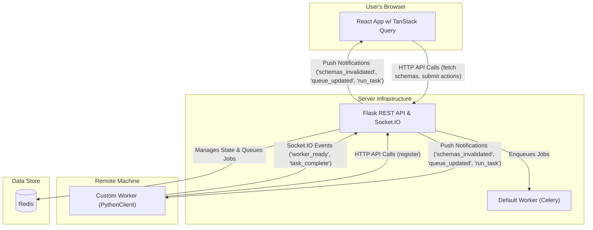
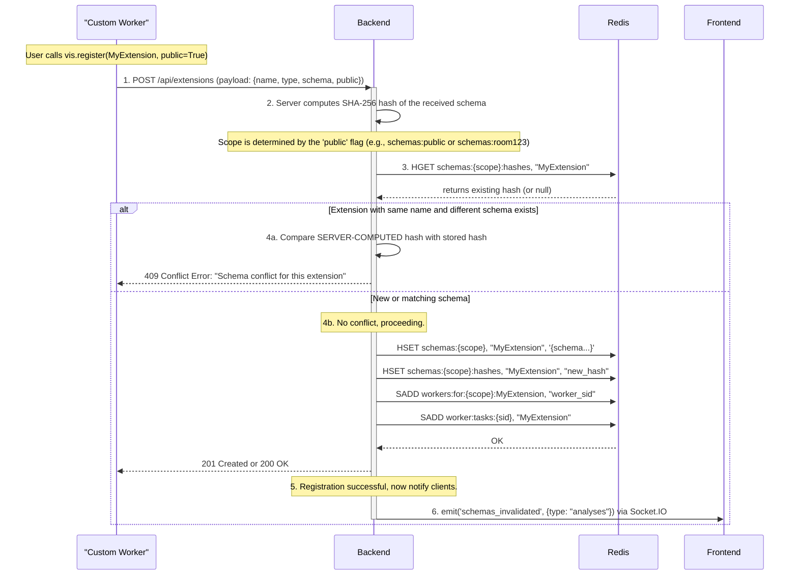
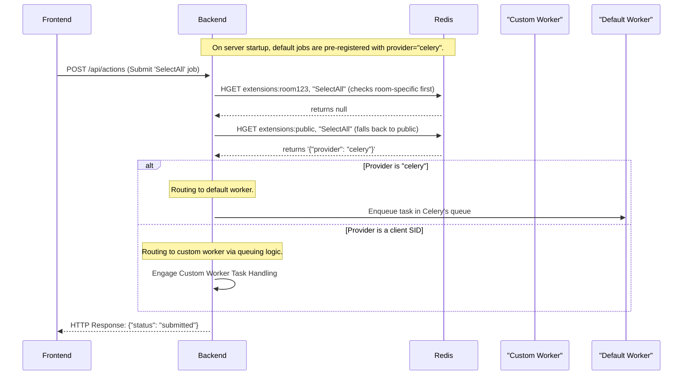
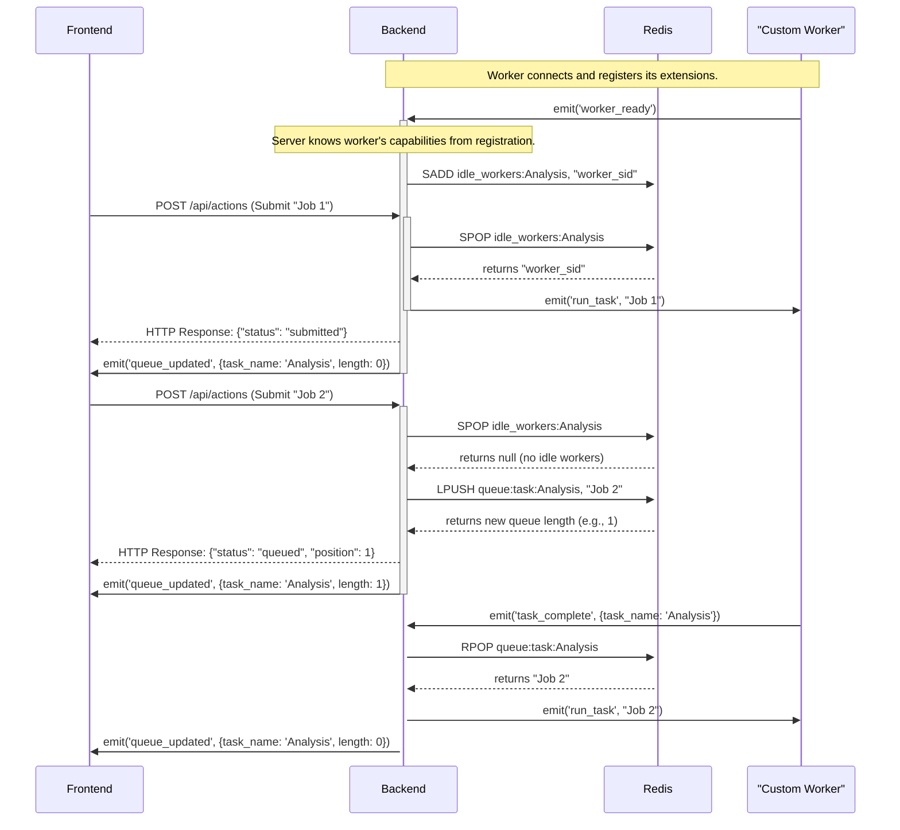
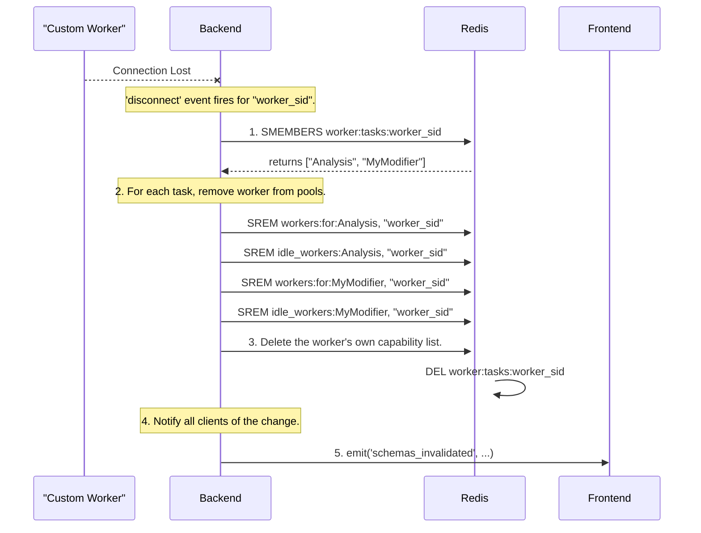
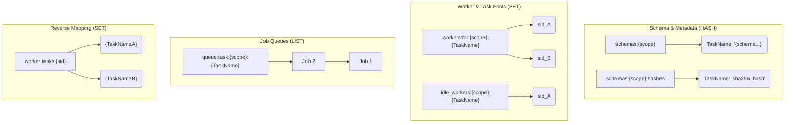
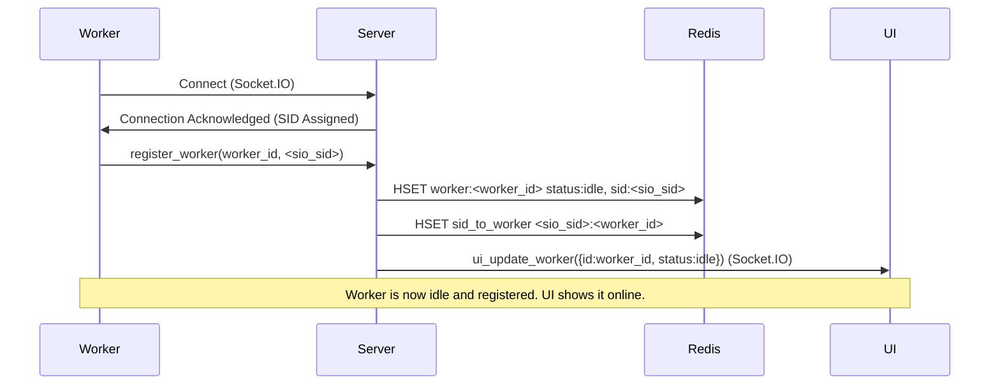
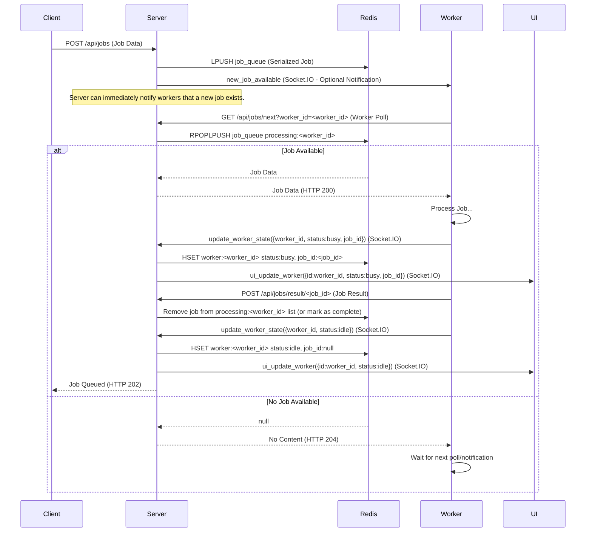
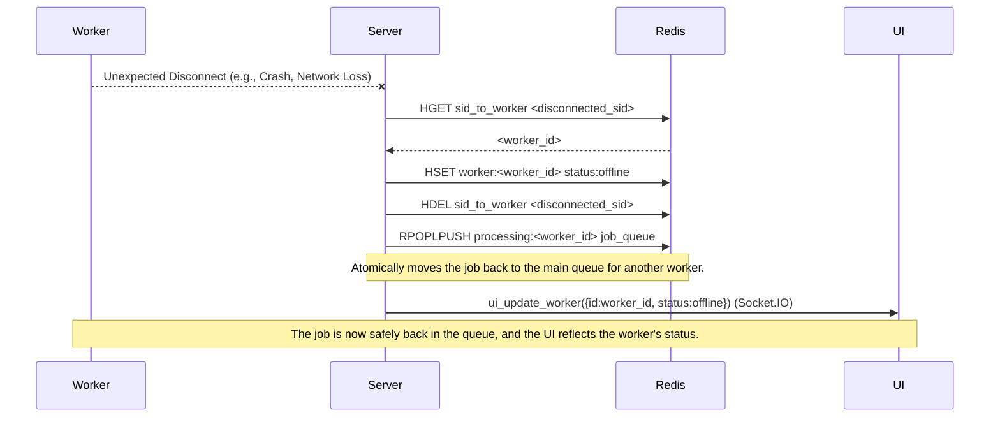
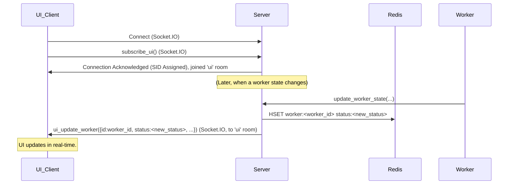

## ZnDraw Worker and Task Management Architecture

This document outlines the architecture for a robust, scalable system for managing and executing tasks from different providers. The system is designed around a central backend that orchestrates work between default (Celery) workers and custom, remote Python (`ZnDraw`) workers.

The core principles are:

  - **Centralized State:** The backend, using Redis, is the single source of truth for all registered extensions, schemas, and worker availability.
  - **Event-Driven Logic:** The backend is entirely event-driven. It reacts to job submissions, worker connections, and task completions without any continuous polling, making it highly efficient.
  - **Decoupled Components:** The frontend, backend, and workers are decoupled. The frontend doesn't know who will run a job, and workers don't know about the backend's internal state.

### Component Overview

**NOTE**: We must prohibit creating a room called `public`!

-----

### 1\. Worker Registration and Schema Validation

A custom worker registers its capabilities (extensions) via a REST API call. The backend is responsible for validating the extension, computing a schema hash to detect conflicts, and storing its metadata in Redis. This process supports multiple workers registering the same extension.

-----

### 2\. Job Lifecycle: Routing and Queuing

The job lifecycle is managed through an event-driven workflow, ensuring efficiency and providing real-time feedback to the user.

#### Job Dispatching Logic

When a job is submitted, the backend first determines the provider responsible for it (a custom worker or a default Celery worker) by checking for a registration first in the room-specific scope, then in the public scope. It then routes the task accordingly.

#### Custom Worker Task Handling and Queuing

If a job is routed to a custom worker, the backend uses a Redis-based queuing system to manage the workload and dispatch tasks to available workers.

-----

### 3\. Worker Disconnect and State Cleanup

To maintain system integrity, the backend must automatically clean up all resources associated with a worker if its connection is lost. This prevents "ghost" workers and ensures the UI accurately reflects available capabilities.

-----

### 4\. Redis Key Structure Overview

The entire system is orchestrated using a structured set of keys in Redis to manage state efficiently.

#  Diagram 1: Worker Registration & Initial State

# Diagram 2: Job Submission & Worker Processing (Successful)

# Diagram 3: Worker Disconnection & Job Re-queue (Fault Tolerance)

# Diagram 4: UI Updates (Simplified)

