# Styles of communication

1. REST + SOCKET.IO
for data heavy operations

2. SOCKET.IO only
for light operations

# Usage
Everything that comes from the `ase.Atoms` uses REST + SOCKET.IO.
Settings and Extensions use REST + SOCKET.IO.

currentStep uses SOCKET.IO only.
Drawing use SOCKET.IO only.
Camera use SOCKET.IO only.
Chat use SOCKET.IO + for fetching history it uses REST + SOCKET.IO.

Extension and schema management use REST + SOCKET.IO mixture (see `actions.md`).

# Nomenclature
`zndraw.extensions.analysis` or `zndraw.extensions.modifiers`
with `ExtensionType.ANALYSIS` and `ExtensionType.MODIFIER`

- Use plural for module/package names (.modifiers, .analysis).
- Use singular for enum members (ExtensionType.MODIFIER, ExtensionType.ANALYSIS).
- Use singular for extension classes (Duplicate, SelectAll).
- `category` -> Selection, Modify, Analysis, ...
- `extension` -> specific extension, e.g. "SelectAll", "Move", "Distance", ...

# Presenter Mode

```mermaid
sequenceDiagram
    participant Client as Client (usePresenterMode)
    participant Socket as socket.io
    participant Server as Server (Flask-SocketIO)
    participant Redis as Redis (presenter_lock store)
    participant Room as Other Clients in Room

    %% Request presenter token
    Client->>Socket: emit('request_presenter_token')
    Socket->>Server: request_presenter_token(sid)
    Server->>Redis: GET room:{room}:presenter_lock
    alt No lock OR same sid
        Server->>Redis: SET room:{room}:presenter_lock = sid (with expiry)
        alt New presenter
            Server-->>Room: emit('presenter_update', { presenterSid: sid })
        end
        Server-->>Socket: {"success": true}
        Socket-->>Client: success=true → setPresenterMode('presenting')
    else Lock held by another sid
        Server-->>Socket: {"success": false, reason:"held by another"}
        Socket-->>Client: success=false → setPresenterMode('locked')
    end

    %% Heartbeat (while presenting)
    loop every 3s (heartbeat)
        Client->>Socket: emit('request_presenter_token')
        Socket->>Server: request_presenter_token(sid)
        Server->>Redis: GET room:{room}:presenter_lock
        alt Lock matches sid
            Server->>Redis: SET lock (renew expiry)
            Server-->>Socket: {"success": true}
        else Lock lost / mismatch
            Server-->>Socket: {"success": false}
            Socket-->>Client: setPresenterMode('idle')
        end
    end

    %% Release token
    Client->>Socket: emit('release_presenter_token')
    Socket->>Server: release_presenter_token(sid)
    Server->>Redis: GET room:{room}:presenter_lock
    alt sid matches lock holder
        Server->>Redis: DELETE lock
        Server-->>Room: emit('presenter_update', { presenterSid: null })
        Server-->>Socket: {"success": true}
        Socket-->>Client: setPresenterMode('idle')
    else sid not holder
        Server-->>Socket: {"success": false, error:"Not current presenter"}
    end

    %% Receiving presenter updates from others
    Server-->>Room: emit('presenter_update', { presenterSid: X })
    Room-->>Client: presenter_update received
    alt presenterSid == null
        Client->>Client: setPresenterMode('idle')
    else presenterSid != null
        Client->>Client: setPresenterMode('locked')<br/>+start 5s timeout
    end
```

