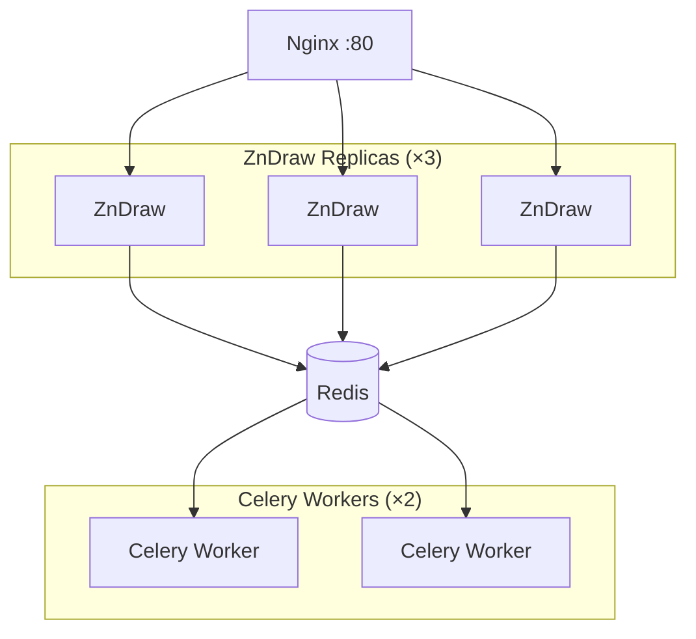

# ZnDraw Production Deployment

Horizontal scaling deployment with Nginx load balancer and multiple ZnDraw instances.

## Quick Start

```bash
docker compose up -d
```

Access at http://localhost

## Architecture



## Scaling

Adjust replicas in `docker-compose.yaml`:

```yaml
services:
  zndraw:
    deploy:
      replicas: 5  # Increase for higher load

  celery-worker:
    deploy:
      replicas: 4  # Increase for more background tasks
```

## With Custom Templates

Mount a local templates directory:

```yaml
services:
  zndraw:
    volumes:
      - zndraw-data:/app/data
      - ./templates:/app/templates:ro
```

## Configuration

| Variable | Description | Default |
|----------|-------------|---------|
| `ZNDRAW_REDIS_URL` | Redis connection | `redis://redis:6379` |
| `FLASK_SECRET_KEY` | Session secret | Change in production! |
| `ZNDRAW_ADMIN_USERNAME` | Admin user | Disabled |
| `ZNDRAW_ADMIN_PASSWORD` | Admin password | Disabled |

## Commands

```bash
# Start
docker compose up -d

# Scale on the fly
docker compose up -d --scale zndraw=5 --scale celery-worker=3

# View logs
docker compose logs -f

# Stop
docker compose down

# Stop and remove data
docker compose down -v
```
