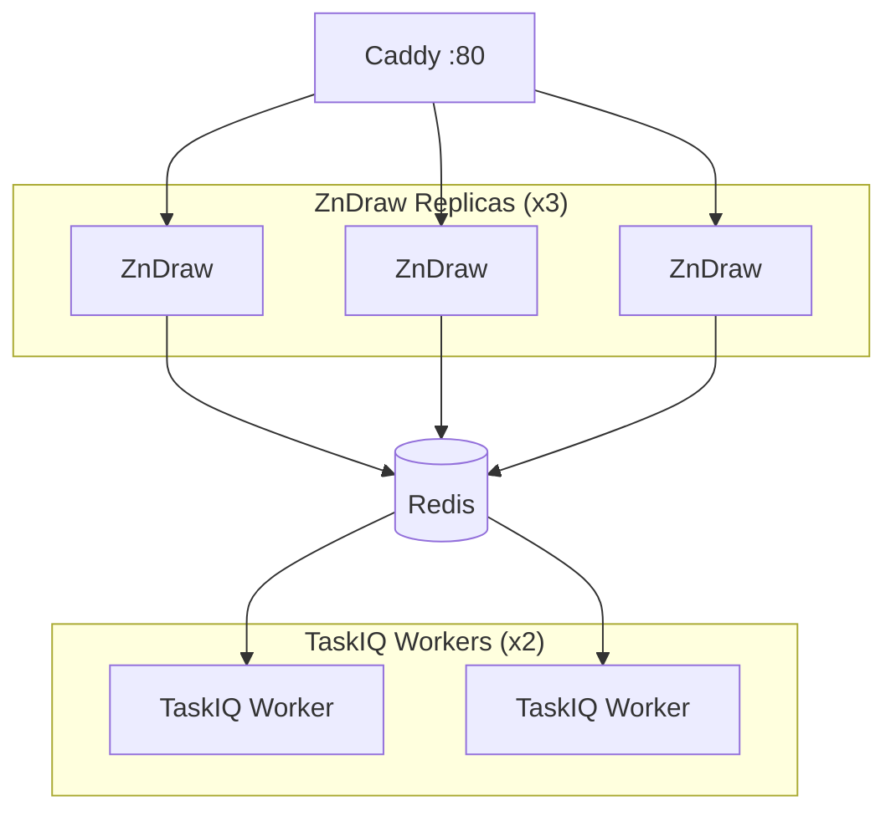

# ZnDraw Production Deployment

Horizontal scaling deployment with Caddy load balancer and multiple ZnDraw instances.

## Quick Start

```bash
docker compose up -d
```

Access at http://localhost

## Architecture


```mermaid
flowchart TB
    caddy[Caddy :80]

    caddy --> zndraw1[ZnDraw]
    caddy --> zndraw2[ZnDraw]
    caddy --> zndraw3[ZnDraw]

    zndraw1 --> redis[(Redis)]
    zndraw2 --> redis
    zndraw3 --> redis

    redis --> worker1[TaskIQ Worker]
    redis --> worker2[TaskIQ Worker]

    subgraph "ZnDraw Replicas (x3)"
        zndraw1
        zndraw2
        zndraw3
    end

    subgraph "TaskIQ Workers (x2)"
        worker1
        worker2
    end
```

## Scaling

Adjust replicas in `docker-compose.yaml`:

```yaml
services:
  zndraw:
    deploy:
      replicas: 5  # Increase for higher load

  taskiq-worker:
    deploy:
      replicas: 4  # Increase for more background tasks
```

## Configuration

| Variable | Description | Default |
|----------|-------------|---------|
| `ZNDRAW_REDIS_URL` | Redis connection | `redis://redis:6379` |
| `ZNDRAW_AUTH_SECRET_KEY` | JWT secret | Change in production! |
| `ZNDRAW_AUTH_DEFAULT_ADMIN_EMAIL` | Admin email | Disabled |
| `ZNDRAW_AUTH_DEFAULT_ADMIN_PASSWORD` | Admin password | Disabled |

## Commands

```bash
# Start
docker compose up -d

# Scale on the fly
docker compose up -d --scale zndraw=5 --scale taskiq-worker=3

# View logs
docker compose logs -f

# Stop
docker compose down

# Stop and remove data
docker compose down -v
```
