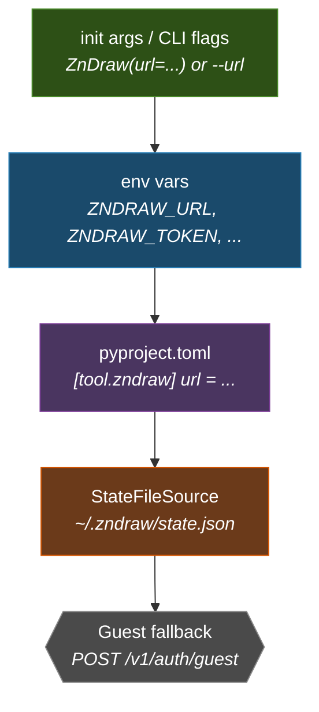
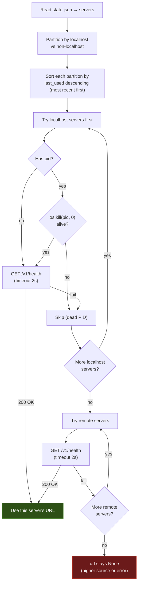
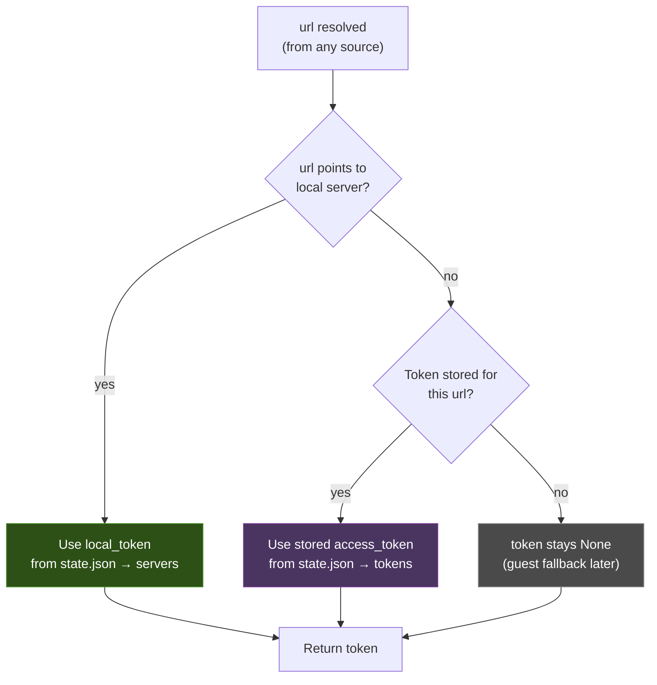
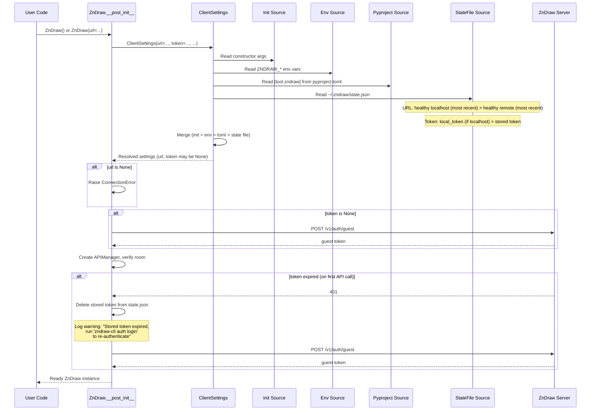

# Pydantic-Settings Unification

**Date:** 2026-03-25
**Scope:** zndraw-fastapi (primary), zndraw-auth + zndraw-joblib (pyproject.toml support)
**Goal:** Unified, consistent settings resolution across server, client, and CLI using pydantic-settings custom sources.

## Problem

Settings resolution is inconsistent across entry points:

1. **Server-side** (`Settings`, `AuthSettings`, `JobLibSettings`) uses pydantic-settings with env vars only. No `pyproject.toml` support, so project-scoped server config requires env vars.

2. **Python client** (`ZnDraw` dataclass) ignores env vars entirely. `ZNDRAW_URL`, `ZNDRAW_USER`, `ZNDRAW_PASSWORD` only work via Typer's `envvar` in the CLI, not when constructing `ZnDraw()` in Python.

3. **CLI** (`zndraw-cli`) wires env vars through Typer's `envvar` parameter, completely separate from pydantic-settings. Duplicates resolution logic in `cli_agent/connection.py`.

4. **Auto-discovery** uses PID files (`~/.zndraw/server-{port}.pid`) for URL and a separate `tokens.json` for stored credentials. Two files, two formats, no unified state.

5. **`zndraw-cli auth login`** stores tokens in `~/.zndraw/tokens.json` but doesn't set a default server. Users must pass `--url` every time after login, despite the server being known.

6. **`shutdown_token`** is written to PID files and sent as `X-Shutdown-Token` header, but the server's `/v1/admin/shutdown` endpoint only checks `AdminUserDep` -- the token is never validated server-side.

7. **Local server admin** requires configuring `ZNDRAW_AUTH_DEFAULT_ADMIN_EMAIL` + `ZNDRAW_AUTH_DEFAULT_ADMIN_PASSWORD` or relying on dev mode (all users are superusers). The user who started the server should be admin automatically.

## Design

### Approach: Composition

Keep `ZnDraw` as a `@dataclass` (it implements `MutableSequence`). Add a `ClientSettings(BaseSettings)` that resolves connection parameters through the full source chain. `ZnDraw.__post_init__` creates `ClientSettings` from its constructor args to fill in missing values.

Server-side classes each gain `PyprojectTomlConfigSettingsSource` independently.

### Two Phases

- **Phase 1 -- Server-side**: Add `pyproject.toml` support to `Settings`, `AuthSettings`, `JobLibSettings`.
- **Phase 2 -- Client/CLI-side**: New `ClientSettings`, `StateFile`, refactor `ZnDraw` + CLI connection logic, local admin token.

No shared code between phases. Phase 1 can ship independently.

## Phase 1: Server-Side pyproject.toml Support

### Changes

Each of the three settings classes adds `PyprojectTomlConfigSettingsSource` in `settings_customise_sources()`:

| Class | Table Header | Env Prefix |
|---|---|---|
| `ClientSettings` | `[tool.zndraw]` | `ZNDRAW_` |
| `Settings` | `[tool.zndraw.server]` | `ZNDRAW_SERVER_` |
| `AuthSettings` | `[tool.zndraw.auth]` | `ZNDRAW_AUTH_` |
| `JobLibSettings` | `[tool.zndraw.joblib]` | `ZNDRAW_JOBLIB_` |

Every class's env prefix matches its TOML table path. `ClientSettings` gets the root `ZNDRAW_` prefix because it's the most user-facing (`ZNDRAW_URL`, `ZNDRAW_ROOM`).

**Breaking change:** `ZNDRAW_PORT` → `ZNDRAW_SERVER_PORT`, `ZNDRAW_DATABASE_URL` → `ZNDRAW_SERVER_DATABASE_URL`, etc. All existing server-side env vars gain the `SERVER_` infix.

### Priority (all server-side classes)

```
init args (Settings(port=9000))                    highest
    |
env vars (ZNDRAW_SERVER_PORT=9000)
    |
pyproject.toml ([tool.zndraw.server])              lowest
```

### Example pyproject.toml

Each settings class reads from its own sub-table. No shared tables, no `extra="ignore"` needed.

```toml
[tool.zndraw]
# Client-side (read by ClientSettings, Phase 2)
url = "https://zndraw.icp.uni-stuttgart.de"
room = "my-project-room"
user = "researcher@uni-stuttgart.de"
password = "secret"  # user's responsibility if committed

[tool.zndraw.server]
# Server-side (read by Settings)
database_url = "postgresql+asyncpg://user:pass@db/zndraw"
redis_url = "redis://redis:6379"
storage = "/data/frames.lmdb"
host = "0.0.0.0"
port = 8000

[tool.zndraw.auth]
secret_key = "production-secret"
token_lifetime_seconds = 7200
default_admin_email = "admin@example.com"
default_admin_password = "secure-password"

[tool.zndraw.joblib]
worker_timeout_seconds = 120
```

### Implementation

Each class overrides `settings_customise_sources()`:

```python
from pydantic_settings import BaseSettings, SettingsConfigDict
from pydantic_settings.main import PydanticBaseSettingsSource

class Settings(BaseSettings):
    model_config = SettingsConfigDict(
        env_prefix="ZNDRAW_SERVER_",
        pyproject_toml_table_header=("tool", "zndraw", "server"),
    )

    @classmethod
    def settings_customise_sources(
        cls,
        settings_cls: type[BaseSettings],
        init_settings: PydanticBaseSettingsSource,
        env_settings: PydanticBaseSettingsSource,
        dotenv_settings: PydanticBaseSettingsSource,
        file_secret_settings: PydanticBaseSettingsSource,
    ) -> tuple[PydanticBaseSettingsSource, ...]:
        from pydantic_settings import PyprojectTomlConfigSettingsSource

        return (
            init_settings,
            env_settings,
            PyprojectTomlConfigSettingsSource(settings_cls),
        )
    # ... fields unchanged ...
```

Same pattern for `AuthSettings` (header: `("tool", "zndraw", "auth")`) and `JobLibSettings` (header: `("tool", "zndraw", "joblib")`).

## Phase 2: Client/CLI-Side Unification

### Component Overview

```
ClientSettings(BaseSettings)
    resolves: url, room, user, password, token
    sources: init > env > pyproject.toml > StateFileSource > guest fallback

StateFile
    replaces: ServerInfo + TokenStore
    file: ~/.zndraw/state.json (mode 0600)
    manages: unified server registry (local + remote), stored tokens

StateFileSource(PydanticBaseSettingsSource)
    custom pydantic-settings source
    reads StateFile for url (health-check-based discovery) and token (stored credentials)

Local Admin Token
    server writes local_token to state.json on start
    server accepts local_token as superuser auth
    ClientSettings uses local_token when connecting to local server
```

### ClientSettings

New `BaseSettings` subclass for client-side connection parameters:

```python
class ClientSettings(BaseSettings):
    model_config = SettingsConfigDict(
        env_prefix="ZNDRAW_",
        pyproject_toml_table_header=("tool", "zndraw"),
    )

    url: str | None = None
    room: str | None = None
    user: str | None = None
    password: SecretStr | str | None = None  # str auto-coerced to SecretStr by pydantic
    token: str | None = None
```

`ClientSettings` reads from `[tool.zndraw]` (the top-level table). Server-side `Settings` reads from `[tool.zndraw.server]`. No table overlap, no `extra="ignore"` needed.

Each class has its own env prefix — no namespace overlap. `env_nested_delimiter` is omitted from `ClientSettings` since it has no nested fields.

### Priority Chain



Higher sources override lower sources. Guest fallback is not a settings source -- it runs in `ClientSettings` post-validation when `token` is still `None`.

### StateFile

Replaces both `ServerInfo` + `TokenStore` with a single `~/.zndraw/state.json` (mode 0600):

```json
{
  "servers": {
    "http://localhost:8000": {
      "pid": 12345,
      "version": "0.5.0",
      "local_token": "random-per-start",
      "added_at": "2026-03-25T10:00:00Z",
      "last_used": "2026-03-25T14:30:00Z"
    },
    "https://zndraw.icp.uni-stuttgart.de": {
      "added_at": "2026-03-24T09:00:00Z",
      "last_used": "2026-03-25T12:00:00Z"
    }
  },
  "tokens": {
    "https://zndraw.icp.uni-stuttgart.de": {
      "access_token": "eyJ...",
      "email": "user@uni.de",
      "stored_at": "2026-03-25T10:00:00Z"
    }
  }
}
```

Both `servers` and `tokens` use the full URL as key. All entries share a common schema with optional local-only fields:

```python
class ServerEntry(BaseModel):
    added_at: datetime
    last_used: datetime
    # Local-only fields (None for remote servers)
    pid: int | None = None
    version: str | None = None
    local_token: str | None = None
```

A server is considered "local" if it has a `pid`. Resolution orders by `last_used` descending — most recently used server is tried first.

Key changes from current state:
- **Merged**: PID files + tokens.json into one file.
- **Unified server registry**: Both local and remote servers live in `servers`. No separate `default_url` — server preference is determined by health checks and recency (see URL Resolution below).
- **`local_token`**: Replaces `shutdown_token`. Generated per server start. Grants superuser access to the local server. Only present on local server entries.
- **`last_used`**: Updated on each successful connection. Resolution orders by `last_used` descending — most recently used server is tried first. `added_at` records creation time for informational purposes.
- **Atomic writes (mandatory)**: All writes use write-to-tempfile-then-`os.rename()` — never overwrite directly. This is especially important because `last_used` updates happen on every successful connection, making writes frequent. `os.rename()` is atomic on POSIX, preventing corruption if the process is killed mid-write. Note: atomic rename prevents partial reads but does not prevent lost updates from concurrent read-modify-write cycles. This is acceptable — the worst case is a `last_used` timestamp being slightly stale, which only affects ordering preference.
- **Migration**: On first access, if old `server-*.pid` or `tokens.json` files exist, migrate them to `state.json` and delete the old files.

### StateFileSource: URL Resolution

The `StateFileSource` resolves `url` from `state.json` using health checks against `/v1/health`. This works for both local and remote servers uniformly.



**How it works:**
1. **Partition** servers into localhost (URL contains `localhost` or `127.0.0.1`) and non-localhost.
2. **Sort** each partition by `last_used` descending — most recently used first.
3. **Try localhost first** — for entries with a `pid`, do a fast `os.kill(pid, 0)` pre-filter to skip dead processes without a network call. Then hit `/v1/health` to confirm.
4. **Then try remote** — hit `/v1/health` directly.
5. **First healthy server wins.**

**Cleanup during resolution:**
- **Local entries with dead PID**: removed immediately — `os.kill(pid, 0)` is definitive, there is no "temporarily dead PID" scenario. Safe to clean up on every access.
- **Remote entries with failed health check**: kept — a failed health check is ambiguous (network blip, server restarting). A warning is logged: `log.warning("Server %s is unreachable. To remove: zndraw-cli auth logout --url %s", url, url)`. Remote entries are only removed explicitly by `auth logout --url ...`.

This eliminates the need for `default_url`. The `auth login --url remote` command adds the remote to `servers`. Starting a local server adds to `servers`. The resolution algorithm always picks the best available server: localhost preferred (active intent), then remote (passive preference), most recently used first within each category.

### StateFileSource: Token Resolution



"Points to local server" means the resolved URL matches a localhost entry in `state.json → servers` that passed the health check. In that case, `local_token` is used directly — it grants superuser access, bypassing the normal auth chain.

**Implementation detail:** Token resolution depends on the already-resolved `url`. `PydanticBaseSettingsSource` does not provide cross-field access to higher-priority values. Instead, `StateFileSource.__call__` uses a two-pass approach internally:

1. **Resolve URL** from `state.json → servers` (health check, partition, sort).
2. **Resolve token** using the URL found in step 1 (or `None` if no URL from this source). If a higher-priority source provides `url`, the source's own URL is discarded during merge, but the token it returned is still valid as long as it was looked up against its own resolved URL (which is the same server the higher source also points to) or is simply overridden by a higher-priority token.

If the source cannot determine a URL (no healthy servers), it returns `{"url": None, "token": None}` and both fields fall through to higher sources or error handling.

### Local Admin Token

The server generates a `local_token` on every start and writes it to `state.json`. The server accepts this token as superuser authentication.

#### Server-Side

On startup (`cli.py`):
1. Generate `local_token = secrets.token_urlsafe(32)` (replaces `shutdown_token`).
2. Write to `state.json → servers → {url} → local_token`.
3. Store `local_token` in `app.state.local_token`.

Auth endpoint or middleware:
- Accept `Authorization: Bearer <local_token>` as superuser. When the token matches `app.state.local_token`, return a synthetic superuser identity.
- This replaces the unused `X-Shutdown-Token` mechanism.
- Normal JWT auth continues to work for all other tokens (guests, logged-in users, remote clients).

`shutdown_server()` (in `server_manager.py`) is updated to read `local_token` from `state.json` and send it as `Authorization: Bearer <local_token>`. The old `X-Shutdown-Token` header logic is removed entirely (it was never validated server-side). Local shutdown now uses the same auth mechanism as all other local admin operations.

#### Client-Side

When `StateFileSource` resolves `url` to a local server, it also sets `token` to that server's `local_token`. The client connects as superuser with zero configuration.

#### Security Properties

- Token regenerated every server start -- no persistence across restarts.
- `state.json` is mode 0600 -- only the owner can read.
- Only applies to local servers -- remote servers use normal auth.
- Remote clients connecting to the same local server use normal auth (they can't read the state file).

### Full Resolution Flow

End-to-end flow showing how `ClientSettings` resolves all fields:



**Note:** `ClientSettings` only resolves field values from sources (no HTTP calls). Guest fallback, token validation, and expiry handling happen in `ZnDraw.__post_init__` after `ClientSettings` returns.

### ZnDraw Integration

`ZnDraw.__post_init__` creates `ClientSettings` from constructor args:

```python
@dataclass
class ZnDraw(MutableSequence[ase.Atoms]):
    url: str | None = None
    room: str | None = None
    user: str | None = None
    password: SecretStr | str | None = None
    token: str | None = None
    # ... other fields ...

    def __post_init__(self) -> None:
        # Normalize password
        if isinstance(self.password, str):
            self.password = SecretStr(self.password)

        # Resolve via pydantic-settings chain
        resolved = ClientSettings(
            url=self.url,
            room=self.room,
            user=self.user,
            password=self.password,
            token=self.token,
        )

        # url is required — if still None after full chain, error out
        if resolved.url is None:
            raise ConnectionError(
                "No ZnDraw server found. Pass url=, set ZNDRAW_URL, "
                "add [tool.zndraw] url to pyproject.toml, or start a local server."
            )
        self.url = resolved.url
        self.room = resolved.room or str(uuid.uuid4())

        # token: guest fallback if still None
        if resolved.token is None:
            self.token = self._guest_fallback(self.url)
        else:
            self.token = resolved.token

        # ... rest of init (APIManager, SocketManager, etc.) ...
```

**Validation boundaries:** `ClientSettings` itself does not validate that `url` or `token` are non-None — all fields are `Optional`. The "url is required" check and guest fallback live in `ZnDraw.__post_init__` (and equivalently in `cli_agent/connection.py`'s `get_connection`), because they require error handling specific to the caller (e.g., `ConnectionError` for Python client, `SystemExit` for CLI).

Constructor args that are not `None` pass through `init_settings` as highest priority. `None` values fall through to env > pyproject > state file.

### CLI Integration

`zndraw-cli` commands replace manual `resolve_url()` / `resolve_token()` with `ClientSettings`:

```python
# Before (cli_agent/connection.py)
def get_connection(url, token, user, password):
    base_url = resolve_url(url)          # manual PID file logic
    resolved_token = resolve_token(...)   # manual 3-tier fallback
    return Connection(base_url, resolved_token)

# After
def get_connection(url, token, user, password):
    settings = ClientSettings(url=url, token=token, user=user, password=password)
    return Connection(settings.url, settings.token)
```

### auth login / logout Flow

```mermaid
flowchart TD
    subgraph "zndraw-cli auth login --url URL"
        L1["Resolve URL"] --> L2["Device-code flow"]
        L2 --> L3["Store token in<br/>state.json → tokens[url]"]
        L3 --> L4["Add url to<br/>state.json → servers[url]<br/>with added_at = last_used = now"]
    end

    subgraph "zndraw-cli auth logout --url URL"
        O1["Resolve URL"] --> O2["Delete token from<br/>state.json → tokens[url]"]
        O2 --> O3["Remove url from<br/>state.json → servers[url]"]
    end

    subgraph "zndraw server start"
        S1["Generate local_token"] --> S2["Write to state.json → servers[url]<br/>with pid, local_token,<br/>added_at = last_used = now"]
        S2 --> S3["Store local_token in app.state"]
    end

    subgraph "zndraw server stop"
        T1["Remove state.json → servers[url]"]
    end
```



### Token Expiry

When a stored token (from `auth login`) expires:

1. `url` survives -- the user chose that server, the intent doesn't expire.
2. `token` is used optimistically -- server returns 401.
3. Expired token is deleted from `state.json → tokens`.
4. `log.warning("Stored token expired for %s. Falling back to guest. Run 'zndraw-cli auth login' to re-authenticate.", url)`.
5. Guest fallback provides a working (but unprivileged) session.

## Migration

### State File Migration

On first `StateFile` access:

1. Check for old `~/.zndraw/server-*.pid` files -- migrate to `state.json → servers`.
2. Check for old `~/.zndraw/tokens.json` -- migrate to `state.json → tokens`.
3. Delete old files after successful migration.
4. Old `shutdown_token` values are dropped (not migrated) since they were unused server-side.

### Backward Compatibility

- `ZnDraw(url=..., token=...)` continues to work exactly as before (init args highest priority).
- Client env vars (`ZNDRAW_URL`, `ZNDRAW_TOKEN`, etc.) continue to work (unchanged prefix).
- Old PID files and tokens.json are auto-migrated on first access.
- No breaking changes to the Python client API.

### Breaking Changes

- **Server env vars renamed**: `ZNDRAW_` → `ZNDRAW_SERVER_` for all server settings. E.g., `ZNDRAW_PORT` → `ZNDRAW_SERVER_PORT`, `ZNDRAW_DATABASE_URL` → `ZNDRAW_SERVER_DATABASE_URL`, `ZNDRAW_REDIS_URL` → `ZNDRAW_SERVER_REDIS_URL`, etc. All Docker Compose files, CI configs, and deployment scripts must be updated.

## Files Changed

### Phase 1
| File | Change |
|---|---|
| `src/zndraw/config.py` | Change `env_prefix` to `ZNDRAW_SERVER_`, add `settings_customise_sources()` with `PyprojectTomlConfigSettingsSource` |
| `src/zndraw/broker.py` | Update docstring referencing `ZNDRAW_REDIS_URL` → `ZNDRAW_SERVER_REDIS_URL` |
| `src/zndraw/database.py` | Update any `ZNDRAW_` references in comments/docstrings |
| `src/zndraw/cli.py` | Update `os.environ` writes to use `ZNDRAW_SERVER_HOST`, `ZNDRAW_SERVER_PORT`, `ZNDRAW_SERVER_DATABASE_URL` |
| `zndraw-auth: settings.py` | Add `settings_customise_sources()` with `PyprojectTomlConfigSettingsSource` |
| `zndraw-joblib: settings.py` | Add `settings_customise_sources()` with `PyprojectTomlConfigSettingsSource` |
| `docker/` | Update all `ZNDRAW_` → `ZNDRAW_SERVER_` in Docker Compose files |
| **Tests (env var rename)** | |
| `tests/conftest.py` | Rename `ZNDRAW_DATABASE_URL` → `ZNDRAW_SERVER_DATABASE_URL`, `ZNDRAW_HOST` → `ZNDRAW_SERVER_HOST`, `ZNDRAW_PORT` → `ZNDRAW_SERVER_PORT`, `ZNDRAW_REDIS_URL` → `ZNDRAW_SERVER_REDIS_URL`, `ZNDRAW_PRESENCE_TTL` → `ZNDRAW_SERVER_PRESENCE_TTL` |
| `tests/test_config.py` | Rename all `ZNDRAW_` env vars to `ZNDRAW_SERVER_`, add pyproject.toml source tests |
| `tests/test_lifespan.py` | Rename `ZNDRAW_REDIS_URL`, `ZNDRAW_DATABASE_URL` → `ZNDRAW_SERVER_*` |
| `tests/test_socketio_scaling.py` | Rename `ZNDRAW_REDIS_URL`, `ZNDRAW_DATABASE_URL` → `ZNDRAW_SERVER_*` |
| `tests/test_cli.py` | Rename `ZNDRAW_HOST`, `ZNDRAW_PORT` → `ZNDRAW_SERVER_*` |
| `tests/test_template_room_isolation.py` | Rename `ZNDRAW_STORAGE` → `ZNDRAW_SERVER_STORAGE` |
| `tests/worker/test_resilience.py` | Rename `ZNDRAW_HOST`, `ZNDRAW_PORT` → `ZNDRAW_SERVER_*` |
| **Documentation** | |
| `README.md` | Update Python API examples to show zero-config `ZnDraw()`, add env var reference section |
| `docs/source/developer-guide.rst` | Update any env var references |

### Phase 2
| File | Change |
|---|---|
| `src/zndraw/client/settings.py` | **New**: `ClientSettings(BaseSettings)` |
| `src/zndraw/state_file.py` | **New**: `StateFile` class (replaces `ServerInfo` + `TokenStore`) |
| `src/zndraw/settings_sources.py` | **New**: `StateFileSource(PydanticBaseSettingsSource)` |
| `src/zndraw/client/core.py` | Refactor `__post_init__` to use `ClientSettings` |
| `src/zndraw/cli_agent/connection.py` | Replace `resolve_url`/`resolve_token` with `ClientSettings` |
| `src/zndraw/auth_utils.py` | Simplify -- guest fallback only (token resolution moved to settings chain) |
| `src/zndraw/server_manager.py` | Remove `ServerInfo`, `TokenStore`, PID file functions. Keep `wait_for_server_ready`, `is_process_running`, `shutdown_server` (updated to use `StateFile`) |
| `src/zndraw/cli.py` | Write `local_token` to `state.json` on server start. Remove entry on stop. |
| `src/zndraw/cli_agent/auth.py` | `auth login` adds remote to `servers`. `auth logout` removes it. |
| `src/zndraw/routes/admin.py` | Accept `local_token` as superuser auth (new dependency or middleware) |
| `src/zndraw/dependencies.py` | Add `LocalTokenOrAdminDep` for local admin token support |
| `tests/` | New tests for `ClientSettings`, `StateFile`, `StateFileSource`, local admin token, migration |

## Testing

Use `/test-driven-development` — write/update tests before implementation.

### Phase 1

**Existing test updates** (env var rename — must be done first, tests will fail until `config.py` prefix changes):
- All test files referencing `ZNDRAW_` server env vars must be updated to `ZNDRAW_SERVER_*`.
- Affected files: `tests/conftest.py`, `tests/test_config.py`, `tests/test_lifespan.py`, `tests/test_socketio_scaling.py`, `tests/test_cli.py`, `tests/test_template_room_isolation.py`, `tests/worker/test_resilience.py`.

**New tests:**
- `pyproject.toml` values loaded correctly for each settings class.
- Env vars override `pyproject.toml` values.
- Init args override env vars.
- Missing `pyproject.toml` is silently ignored (no error).

### Phase 2
- `ClientSettings` resolves through full chain (init > env > toml > state file > guest).
- `StateFile` read/write/migration from old format.
- Health-check-based discovery prefers localhost (most recently used) over remote (most recently used).
- `local_token` grants superuser access to local server.
- `local_token` is rejected for remote servers.
- `auth login` adds remote to `servers` and stores token.
- `auth logout` removes from `servers` and clears token.
- Token expiry falls back to guest with warning.
- Concurrent access to `state.json` (server + CLI) uses atomic writes.
- `ZnDraw()` with zero args connects to local server as admin.
- `ZnDraw(url="remote")` with stored token connects as authenticated user.
