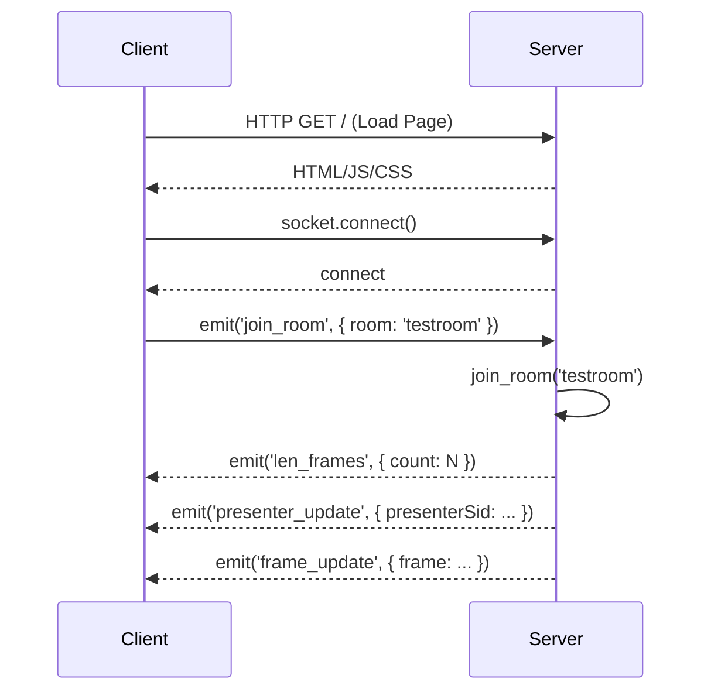
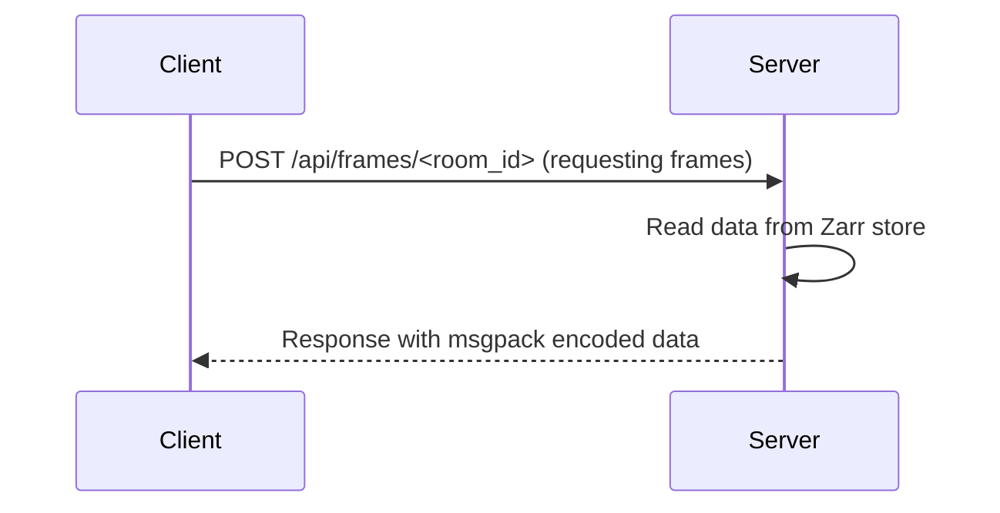
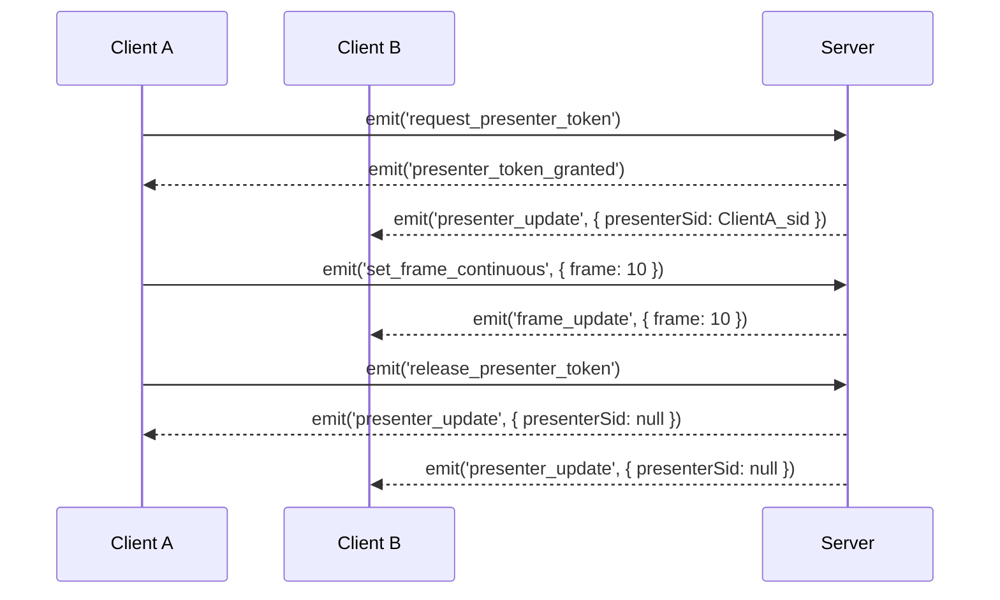
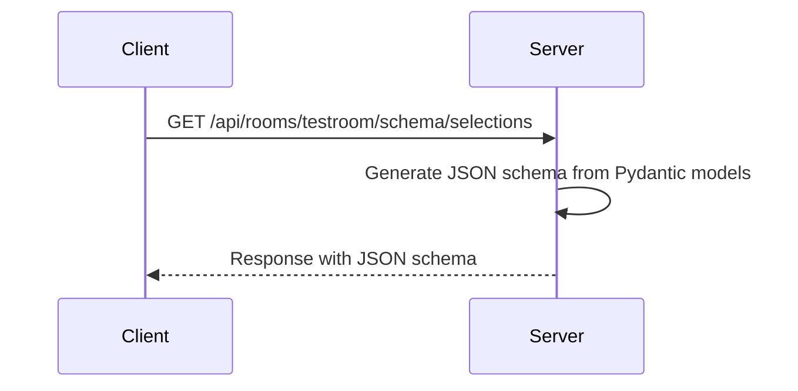
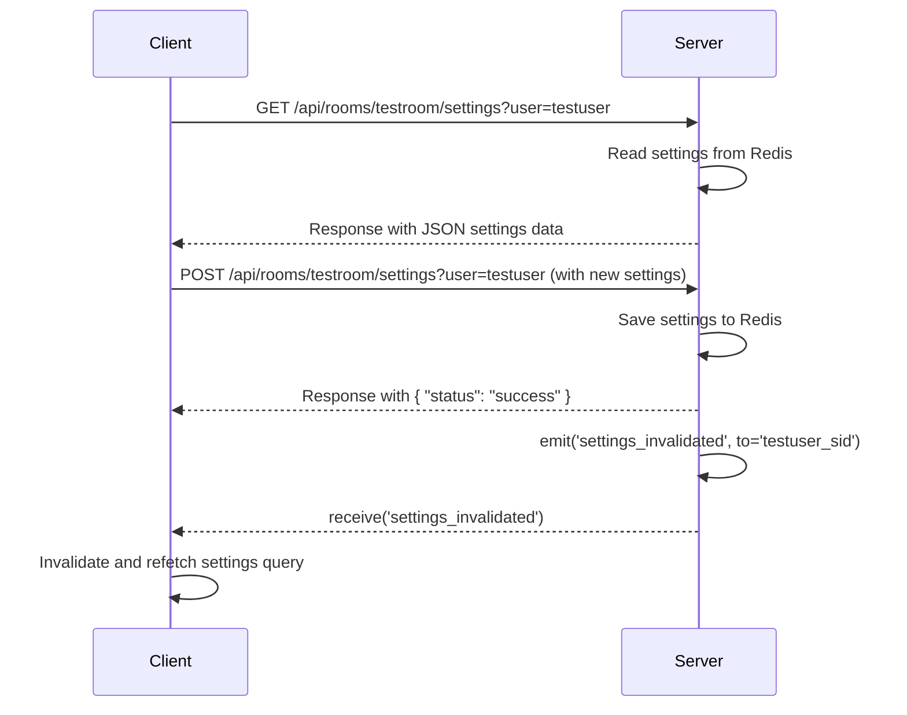

# ZnDraw Communication Summary

This document outlines the communication between the frontend and backend of the ZnDraw application. The application uses a combination of a REST API and WebSockets (Socket.IO) to facilitate real-time collaboration and data exchange.

## Frontend (`/app`)

The frontend is a React application built with Vite. It uses `socket.io-client` to establish a WebSocket connection with the backend.

### Key Components:

-   **`socket.ts`**: Initializes the Socket.IO client, connecting to `http://localhost:5000`. The connection is not established automatically (`autoConnect: false`).
-   **`hooks/useSocketManager.ts`**: This custom hook is the core of the frontend's real-time communication logic. It manages the socket connection, event listeners, and state updates.
    -   It connects to the socket and joins a room when a user enters a room.
    -   It listens for events from the server and updates the application state accordingly using a Zustand store.
-   **`pages/landingPage.tsx`**: The main page of the application, which uses the `useSocketManager` hook to establish a connection and join a room based on the URL parameters (`roomId` and `userId`).

## Backend (`/src/zndraw`)

The backend is a Python Flask application that uses `flask-socketio` for WebSocket communication and Redis for state management and messaging.

### Key Components:

-   **`server.py`**: The main entry point for the backend application. It creates a Flask app, initializes Socket.IO, and connects to Redis.
-   **`app/events.py`**: This module defines all the Socket.IO event handlers. It manages user connections, room joining, and real-time updates for presenter status and frame changes. It uses Redis to store and synchronize state across all clients in a room.
-   **`app/routes.py`**: This module defines the REST API endpoints. These endpoints are used for fetching and uploading frame data, which can be large and is not suitable for WebSocket messages. The data is stored in a Zarr store and serialized using `msgpack`.
-   **`settings.py`**: Defines the Pydantic models for the room configuration and other settings.

## Communication Flow

### 1. Initial Connection and Room Joining

The following diagram illustrates the process of a client connecting to the server and joining a room.

### 2. Frame Data Exchange (REST API)

Frame data is exchanged via the REST API to handle potentially large datasets efficiently.

### 3. Real-time Updates (WebSockets)

Real-time updates, such as presenter changes and frame navigation, are handled via WebSockets.

### 4. Schema Communication (REST API)

UI schemas for forms are fetched via the REST API. This data is considered static and is cached indefinitely on the client.

### 5. Settings Communication (REST API & WebSockets)

User-specific settings are fetched and saved via the REST API. A WebSocket event is used to notify clients of updates.

## Summary

The application uses a hybrid approach to communication, leveraging the strengths of both REST and WebSockets. The REST API is used for fetching and uploading large data payloads, as well as for fetching configuration data like schemas and settings. WebSockets are used for real-time updates and synchronization between clients. This architecture allows for a responsive and collaborative user experience.